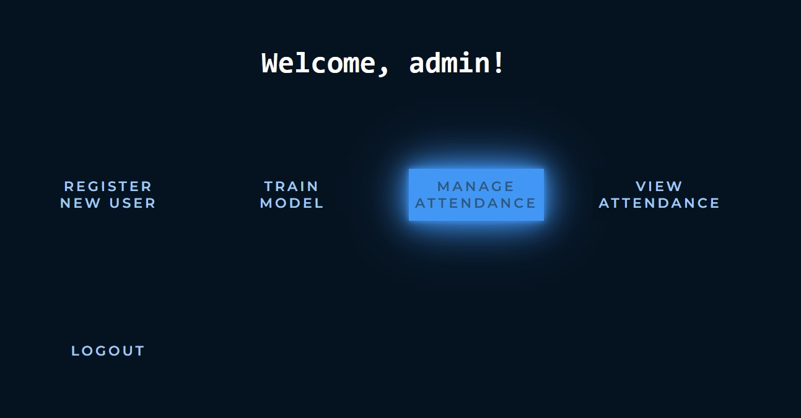

<div id="top"></div>


<h2 align="center">Face-Recognition-Attendance</h2>

  <p align="center">
    A Face Recognition based Attendance WebApp built with Flask and Python
    <br />
    <br />
    <a href="https://github.com/github_username/repo_name">View Demo</a>
  </p>
</div>


<!-- TABLE OF CONTENTS -->
<details>
  <summary>Table of Contents</summary>
  <ol>
    <li>
      <a href="#about-the-project">About The Project</a>
      <ul>
        <li><a href="#built-with">Built With</a></li>
      </ul>
    </li>
    <li>
      <a href="#getting-started">Getting Started</a>
      <ul>
        <li><a href="#prerequisites">Prerequisites</a></li>
        <li><a href="#installation">Installation</a></li>
      </ul>
    </li>
    <li><a href="#usage">Usage</a></li>
    <li><a href="#roadmap">Roadmap</a></li>
    <li><a href="#contributing">Contributing</a></li>
    <li><a href="#license">License</a></li>
    <li><a href="#contact">Contact</a></li>
    <li><a href="#acknowledgments">Acknowledgments</a></li>
  </ol>
</details>


<!-- ABOUT THE PROJECT -->
## About The Project


This is a browser-based application  to demonstrate application of Face Recognition technology in Tracking attendance of a student in an offline setting,
by using Machine Learning Models from scikit-learn and OpenCV library in Python.


<p align="right">(<a href="#top">back to top</a>)</p>


### Built With

* [Flask](https://flask.palletsprojects.com/en/2.1.x/)
* [Python](https://www.python.org/)
* [OpenCV](https://opencv.org/)
* [scikit-learn](https://scikit-learn.org/stable/)
* [sqlite3](https://www.sqlite.org/index.html)

<p align="right">(<a href="#top">back to top</a>)</p>


<!-- GETTING STARTED -->
## Getting Started

To get a local copy up and running follow these simple steps.

### Installation

1. Clone the repo
   ```sh
   git clone https://github.com/Fleonex/Face-Recognition-Attendance.git
   ```
2. Navigate to the project directory and start the python virtual environment
   ```sh
   .\venv\Scripts\activate
   ```
3. Install all the requirements from requirements.txt
   ```sh
   pip install -r requirements.txt
   ```

<p align="right">(<a href="#top">back to top</a>)</p>


<!-- USAGE EXAMPLES -->
## Usage
### Register a user
Before using the app, you have to first register yourselves and generate your dataset to allow the face recognition system to recognize you.
</br>
Only the admin ( course coordinator ) can register a new student.
</br>
</br>
In order to access the admin portal, Click on the Login Button on the main page.

Login with the admin account whose credentials are
</br>
</br>
<strong>Username</strong> : admin
</br>
<strong>Password</strong> : password
</br>
</br>

</br>
</br>
You will be greeted by the admin dashboard
</br>
</br>
Click on the "Register New User" Button

</br>
</br>
Fill in the details
</br>
</br>

</br>
</br>
After correctly filling the form, your webcam will activate and your dataset will be generated. 
Please be seated in a well lit room and be patient as 100 photos will be taken
</br>
</br>

</br>
</br>
After the photos have been taken, you will be greeted with this confirmation screen
</br>
</br>

</br>
</br>
And your photos would have been added to the dataset directory under your name
</br>
</br>

</br>
</br>
Now you have been successfully registered, but the model has not been trained to recognize you yet.
### Train the model
In order to update the face recognition system, the model has to be trained again. 
</br>
</br>
This has been done separately and not immediately after registration is to allow the registration of multiple users before updating the model as the training takes time.
</br>
</br>
To train the model go to the admin dashboard and click on the "Train Model" Button
</br>
</br>

</br>
</br>
As mentioned before this process takes time. You will be waiting in the waiting screen for around 3 to 4 minutes
</br>
</br>

</br>
</br>
After completion, You will be greeted by the confirmation page and redirected to the admin dashboard
</br>
</br>

</br>
</br>
Now you can mark your attendance!
</br>
</br>
### Marking Attendance

In order to Mark your attendance, first the course coordinator (admin) has to start the attendance.
</br>
</br>
This can be done by clicking the "Manage Attendance" button in the admin dashboard
</br>
</br>

</br>
</br>
and starting the attendance
</br>
</br>

</br>
</br>
Now the students can click on the "Mark Attendance" button in the main page to choose the course and mark their attendance
</br>
</br>


</br>
</br>
### View Attendance
You can view your attendance by logging into your account and clicking on the view attendance button
</br>
</br>


</br>
</br>
<p align="right">(<a href="#top">back to top</a>)</p>


<!-- ROADMAP -->
## Roadmap

- [ ] Feature 1
- [ ] Feature 2
- [ ] Feature 3
    - [ ] Nested Feature

See the [open issues](https://github.com/github_username/repo_name/issues) for a full list of proposed features (and known issues).

<p align="right">(<a href="#top">back to top</a>)</p>


<!-- CONTRIBUTING -->
## Contributing

Contributions are what make the open source community such an amazing place to learn, inspire, and create. Any contributions you make are **greatly appreciated**.

If you have a suggestion that would make this better, please fork the repo and create a pull request. You can also simply open an issue with the tag "enhancement".
Don't forget to give the project a star! Thanks again!

1. Fork the Project
2. Create your Feature Branch (`git checkout -b feature/AmazingFeature`)
3. Commit your Changes (`git commit -m 'Add some AmazingFeature'`)
4. Push to the Branch (`git push origin feature/AmazingFeature`)
5. Open a Pull Request

<p align="right">(<a href="#top">back to top</a>)</p>


<!-- LICENSE -->
## License

Distributed under the MIT License. See `LICENSE.txt` for more information.

<p align="right">(<a href="#top">back to top</a>)</p>


<!-- CONTACT -->
## Contact

Your Name - [@twitter_handle](https://twitter.com/twitter_handle) - email@email_client.com

Project Link: [https://github.com/github_username/repo_name](https://github.com/github_username/repo_name)

<p align="right">(<a href="#top">back to top</a>)</p>


<!-- ACKNOWLEDGMENTS -->
## Acknowledgments

* []()
* []()
* []()

<p align="right">(<a href="#top">back to top</a>)</p>


<!-- MARKDOWN LINKS & IMAGES -->
<!-- https://www.markdownguide.org/basic-syntax/#reference-style-links -->
[contributors-shield]: https://img.shields.io/github/contributors/github_username/repo_name.svg?style=for-the-badge
[contributors-url]: https://github.com/github_username/repo_name/graphs/contributors
[forks-shield]: https://img.shields.io/github/forks/github_username/repo_name.svg?style=for-the-badge
[forks-url]: https://github.com/github_username/repo_name/network/members
[stars-shield]: https://img.shields.io/github/stars/github_username/repo_name.svg?style=for-the-badge
[stars-url]: https://github.com/github_username/repo_name/stargazers
[issues-shield]: https://img.shields.io/github/issues/github_username/repo_name.svg?style=for-the-badge
[issues-url]: https://github.com/github_username/repo_name/issues
[license-shield]: https://img.shields.io/github/license/github_username/repo_name.svg?style=for-the-badge
[license-url]: https://github.com/github_username/repo_name/blob/master/LICENSE.txt
[linkedin-shield]: https://img.shields.io/badge/-LinkedIn-black.svg?style=for-the-badge&logo=linkedin&colorB=555
[linkedin-url]: https://linkedin.com/in/linkedin_username
[product-screenshot]: images/screenshot.png
