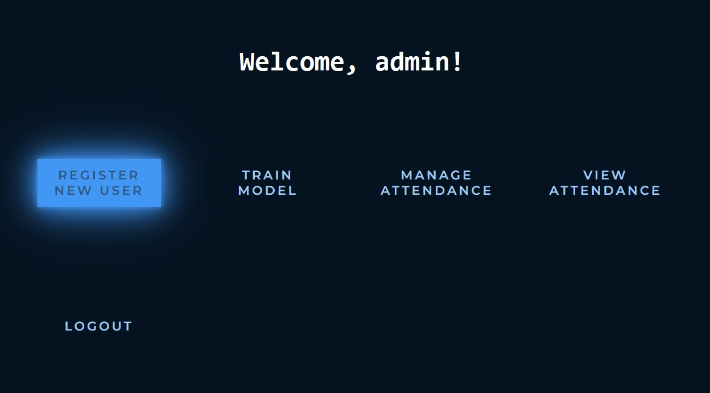
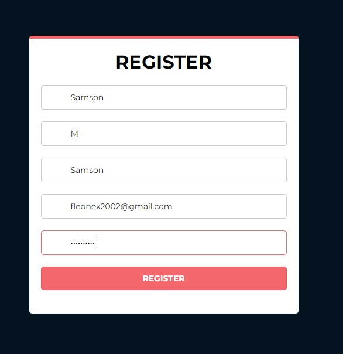
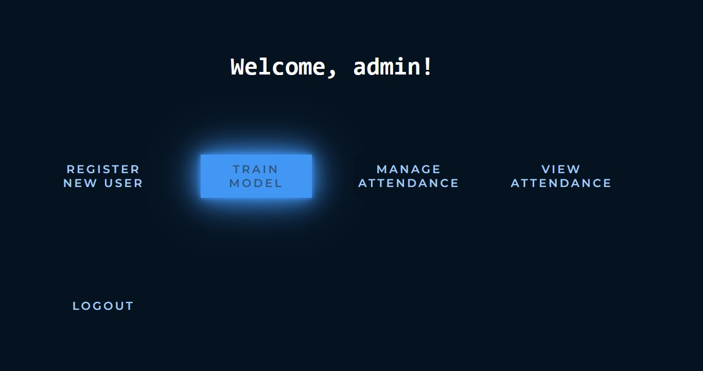

<div id="top"></div>


<h2 align="center">Face-Recognition-Attendance</h2>

  <p align="center">
    A Face Recognition based Attendance WebApp built with Flask and Python
    <br />
    <br />
    <a href="https://github.com/github_username/repo_name">View Demo</a>
  </p>
</div>


<!-- ABOUT THE PROJECT -->
## About The Project
</br>
</br>

</br>
</br>
This is a browser-based application  to demonstrate application of Face Recognition technology in Tracking attendance of a student in an offline setting,
by using Machine Learning Models from scikit-learn and OpenCV library in Python.


<p align="right">(<a href="#top">back to top</a>)</p>


### Built With

* [Flask](https://flask.palletsprojects.com/en/2.1.x/)
* [Python](https://www.python.org/)
* [OpenCV](https://opencv.org/)
* [scikit-learn](https://scikit-learn.org/stable/)
* [sqlite3](https://www.sqlite.org/index.html)

<p align="right">(<a href="#top">back to top</a>)</p>


<!-- GETTING STARTED -->
## Getting Started

To get a local copy up and running follow these simple steps.

### Installation

1. Clone the repo
   ```sh
   git clone https://github.com/Fleonex/Face-Recognition-Attendance.git
   ```
2. Navigate to the project directory and start the python virtual environment
   ```sh
   .\venv\Scripts\activate
   ```
3. Install all the requirements from requirements.txt
   ```sh
   pip install -r requirements.txt
   ```
### Running the App

 After the installation has been done, open cmd in the directory and run app.py
   ```sh
   python app.py
   ```
   Now the webapp will be running on your local host port 5000
   ```sh
   http://localhost:5000
   ```
<p align="right">(<a href="#top">back to top</a>)</p>


<!-- USAGE EXAMPLES -->
## Usage
### Register a user
Before using the app, you have to first register yourselves and generate your dataset to allow the face recognition system to recognize you.
</br>
Only the admin ( course coordinator ) can register a new student.
</br>
</br>
In order to access the admin portal, Click on the Login Button on the main page.
</br>
</br>

</br>
</br>
Login with the admin account whose credentials are
</br>
</br>
<strong>Username</strong> : admin
</br>
<strong>Password</strong> : password
</br>
</br>

</br>
</br>
You will be greeted by the admin dashboard
</br>
</br>
Click on the "Register New User" Button
</br>
</br>

</br>
</br>
Fill in the details
</br>
</br>

</br>
</br>
After correctly filling the form, your webcam will activate and your dataset will be generated. 
Please be seated in a well lit room and be patient as 100 photos will be taken
</br>
</br>

</br>
</br>
After the photos have been taken, you will be greeted with this confirmation screen
</br>
</br>

</br>
</br>
And your photos would have been added to the dataset directory under your name
</br>
</br>

</br>
</br>
Now you have been successfully registered, but the model has not been trained to recognize you yet.
### Train the model
In order to update the face recognition system, the model has to be trained again. 
</br>
</br>
This has been done separately and not immediately after registration is to allow the registration of multiple users before updating the model as the training takes time.
</br>
</br>
To train the model go to the admin dashboard and click on the "Train Model" Button
</br>
</br>

</br>
</br>
As mentioned before this process takes time. You will be waiting in the waiting screen for around 3 to 4 minutes
</br>
</br>

</br>
</br>
After completion, You will be greeted by the confirmation page and redirected to the admin dashboard
</br>
</br>

</br>
</br>
Now you can mark your attendance!
</br>
</br>
### Marking Attendance

In order to Mark your attendance, first the course coordinator (admin) has to start the attendance.
</br>
</br>
This can be done by clicking the "Manage Attendance" button in the admin dashboard
</br>
</br>

</br>
</br>
and starting the attendance
</br>
</br>

</br>
</br>
Now the students can click on the "Mark Attendance" button in the main page to choose the course and mark their attendance
</br>
</br>

</br>

</br>

</br>

</br>

</br>

</br>
</br>
### View Attendance
You can view your attendance by logging into your account and clicking on the view attendance button
</br>
</br>

</br>

</br>

</br>
</br>
<p align="right">(<a href="#top">back to top</a>)</p>


<!-- FEATURES -->
## Features

- Registering a user
    - Generating a dataset for the registered user
    - Augmenting the generated dataset
    - Training the Model to update it
- Login
    - Separated user into admin and normal
    - Dashboard for both
    - Admin can manage the attendance and register a new user
    - User can login and view their attendance 
- Automatic Attendance Marking
    - After the attendance has begun, a user can mark their attendance with ease
    - Check In and Check Out time are noted
    - User can choose which course to mark attendance for
- Viewing Attendance
    - A student can login to view his attendance for any course
    - An admin can login to view overall attendance


<p align="right">(<a href="#top">back to top</a>)</p>


<!-- How Does It Work? -->
## How is the Face Recognition done?

### Step 1: Data preprocessing

Here the dataset is generated and labelled. Then the generated dataset is augmented. Then the augmented dataset is processed into usable data in the form of vectors
which hold the face descriptions. This is done in app.py and data_preprocessing.py

### Step 2: Evaluating the model

Here the data generated from preprocessing is used to train the 3 classfiers, Logisitic Regression, Support Vector Machines and Random Forest Classifier which predicts the name of the face. These 3 classifiers are combined using the voting classifier by assigning weights to each of them. The weights assigned are
1. Logistic Regression : 2
2. Support Vector Machines : 3
3. Random Forest Classifier : 1
</br>
These weights have been assigned after testing with each model separately. This has been done in evaluating_model.py

### Step 3: Tuning the model

After combining the models, the parameters of each of the three individual models have been tuned using GridSearchCV and passing the parameters and the values that have to be tested. This has been done in evaluating_model.py

### Step 4: Pipeline all models

This step is to combine all the different models i.e. the face detection model, the face descriptor model and the face recognition model into one function that can be used to perform all these functions in an orderly way. This has been done in pipeline_webcam.py


<p align="right">(<a href="#top">back to top</a>)</p>

<!-- ADDITIONAL INFORMATION -->
## Additional Files
A file called Real_Time_Face_Recognition.py has been added to showcase the working of face recognition
</br>
</br>


<!-- CONTACT -->
## Contact
M Samson
</br>
</br>
EMAIL : fleonex2002@gmail.com
</br>
PHONE NO. : +91-9606214412

<p align="right">(<a href="#top">back to top</a>)</p>


